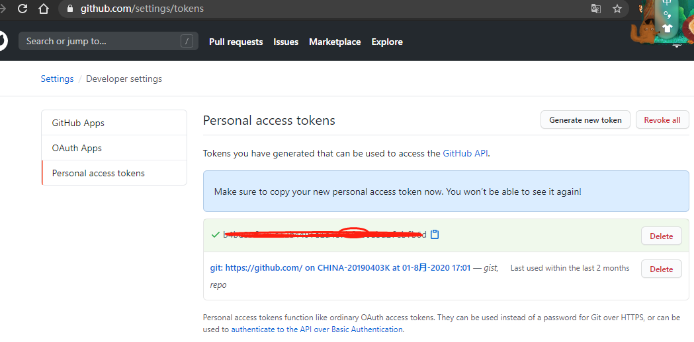

# 错误合集

## 1. fatal: Authentication failed for

证书错误

方法1：
1.配置用户信息
2.查看用户信息

```JavaScript
git config --global user.name [username]
git config --global user.email [email]

git config --list

git config --system --unset credential.helper
```

方法2：
计算机 -- 属性 -- 用户账户 -- 凭证管理器 -- windows 凭证 -- 删除 git 凭证

## 2. fatal: HttpRequestException encountered

git 在 window 凭证管理器过期了，下载新的更换

## 3. 弹出登录框，要输入账户密码

这里的密码并不是 github 账户的密码，而是 token
[参考](https://www.cnblogs.com/tolingsoft/p/12060864.html)

github --> Settings --> Developer settings --> Personal access tokens


